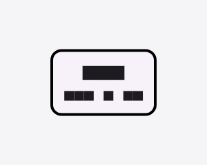
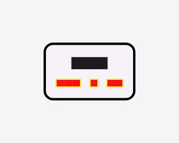

# golden_lens

**Golden tests that tell you _which widget_ and _which source line_ changed — and hand an AI agent a scored, structured visual diff instead of a raw screenshot.**

When a golden fails, `flutter test` tells you *"pixels changed"*. It doesn't tell you **what**. golden_lens does:

```
✗ card.png — parity 96.2%
  1. Card        lib/widgets/card.dart:42   (1,840 px, shadow region)
  2. Text        lib/widgets/card.dart:51   (96 px, baseline)
```

…and emits a machine-readable report an AI coding agent (Claude, Copilot, Cursor) can act on:

```json
{
  "status": "fail",
  "parity": { "metric": "ssim", "score": 0.962, "passed": false },
  "offenders": [
    {
      "rank": 1,
      "widget": "Card",
      "location": { "file": "lib/widgets/card.dart", "line": 42, "column": 12 },
      "region": { "left": 16, "top": 120, "width": 364, "height": 48 },
      "magnitude": 0.41,
      "suggestion": "Card at lib/widgets/card.dart:42 changed (region parity 78.0%). Review this widget."
    }
  ]
}
```

> **I gave the agent eyes that can count pixels and read line numbers.**

## See it

| Golden (baseline) | New (price recolored) | golden_lens diff |
| :---: | :---: | :---: |
|  |  |  |

*Only the price color changed. golden_lens highlights exactly the changed region, boxes the offending widgets, and names each one's source line — overall parity 99.4%. (These are real Flutter golden renders; the blocky glyphs are the default test font.)*

golden_lens is the **layer above** [`alchemist`](https://pub.dev/packages/alchemist) and the built-in `matchesGoldenFile` — not a replacement. Install it once and *every* existing golden test (including your alchemist suite) gains attribution, with **zero test changes**.

---

## Why

Golden testing in Flutter has matured, but one gap remains: a failing golden gives you a pixel-diff image and a human to squint at it. There's been no programmatic way to say *which widget* and *which line of code* a visual change belongs to — the quantitative, attributable signal that both humans and AI agents need to act fast. golden_lens fills that gap using Flutter's own widget-creation tracking (the data that powers the DevTools inspector) — entirely in Dart, at test time. See [flutter/flutter#157862](https://github.com/flutter/flutter/issues/157862) for the related platform discussion.

## How it works

1. On a golden **failure**, golden_lens diffs the candidate against the golden (anti-alias-tolerant).
2. It clusters the changed pixels into regions.
3. It walks the live render tree, mapping each region to the **innermost owning widget** — and resolves framework-internal render objects up to *your* source line (so a `Container` points at your `Container(...)`, not Flutter's internals).
4. It scores **perceptual parity** (SSIM), globally and per region.
5. It writes a **human HTML report** and an **agent JSON payload**.

It never changes your test's pass/fail. It only enriches failures.

## Install

```yaml
dev_dependencies:
  golden_lens: ^0.1.0
```

Then create `test/flutter_test_config.dart` (Flutter runs this before your tests automatically):

```dart
import 'dart:async';
import 'package:golden_lens/golden_lens.dart';

Future<void> testExecutable(FutureOr<void> Function() main) async {
  installGoldenLens();
  await main();
}
```

That's it. Run your goldens as usual:

```dart
testWidgets('card golden', (tester) async {
  await tester.pumpWidget(const MyCardScreen());
  await expectLater(find.byType(MyCardScreen), matchesGoldenFile('card.png'));
});
```

On a mismatch you'll find `golden_lens/card.report.json` and `golden_lens/card.report.html` next to your tests.

## Configuration

```dart
installGoldenLens(
  config: GoldenLensConfig(
    parityThreshold: 0.99,                 // advisory score gate (never changes pass/fail)
    outputDir: 'golden_lens',              // where reports are written
    formats: {ReportFormat.json, ReportFormat.html},
    maxOffenders: 25,
    diffOptions: DiffOptions(
      perChannelThreshold: 16,             // anti-alias tolerance
      minClusterPixels: 12,                // drop speckle noise
    ),
  ),
);
```

## Works with alchemist

alchemist funnels through the same `goldenFileComparator`, so installing golden_lens gives your entire alchemist suite attribution for free — no API contact between the two packages.

## Status & roadmap

v0.1 is focused and honest about scope. Next:

- **v0.2** — anti-alias-hardened SSIM, clip/z-order-aware hit-testing, side-by-side region overlays in HTML.
- **v0.3** — an MCP server exposing the scored diff as an agent tool (close the visual feedback loop).
- **v0.4** — Figma-design-parity mode.

Current v0.1 attributes against the whole render tree, which is exact for whole-screen / single-widget goldens; precise sub-widget scoping for busy screens is on the roadmap.

## License

MIT © Muhammad Umer
